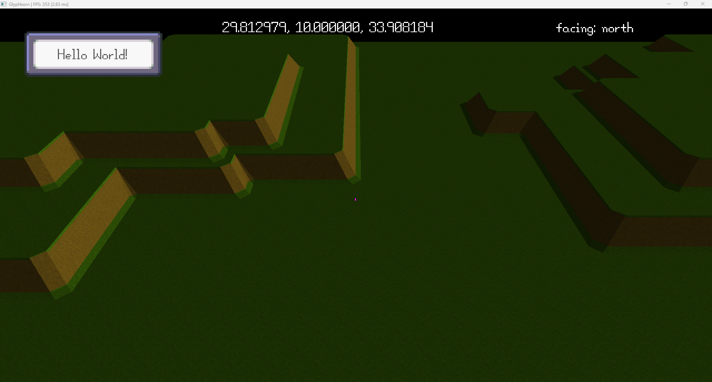
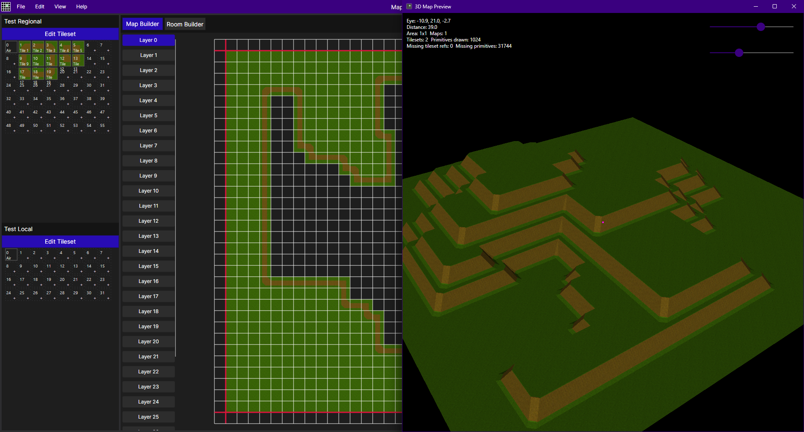
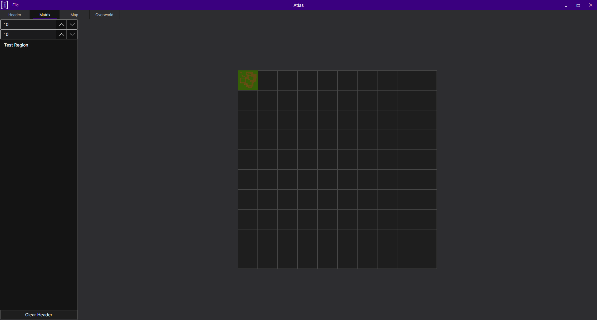
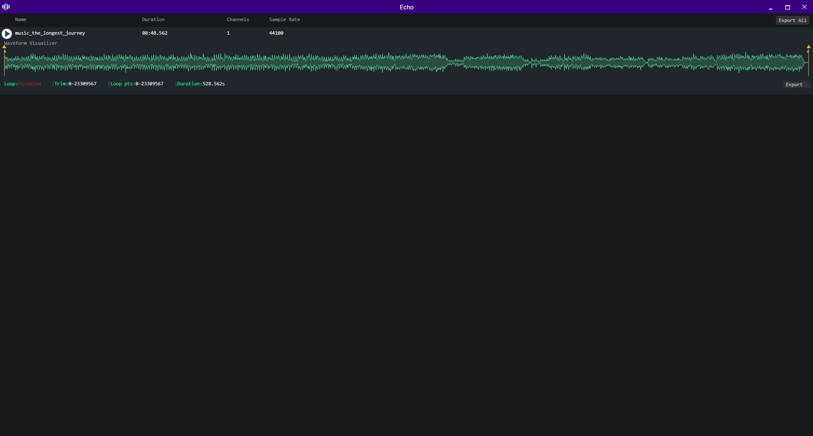
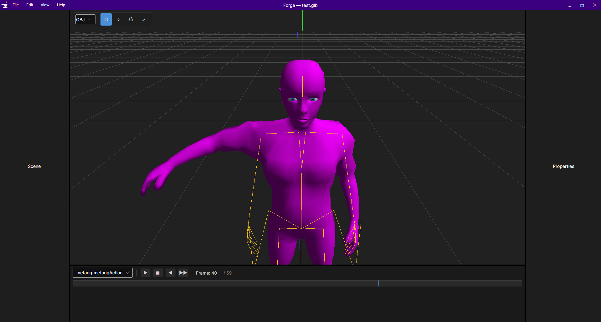
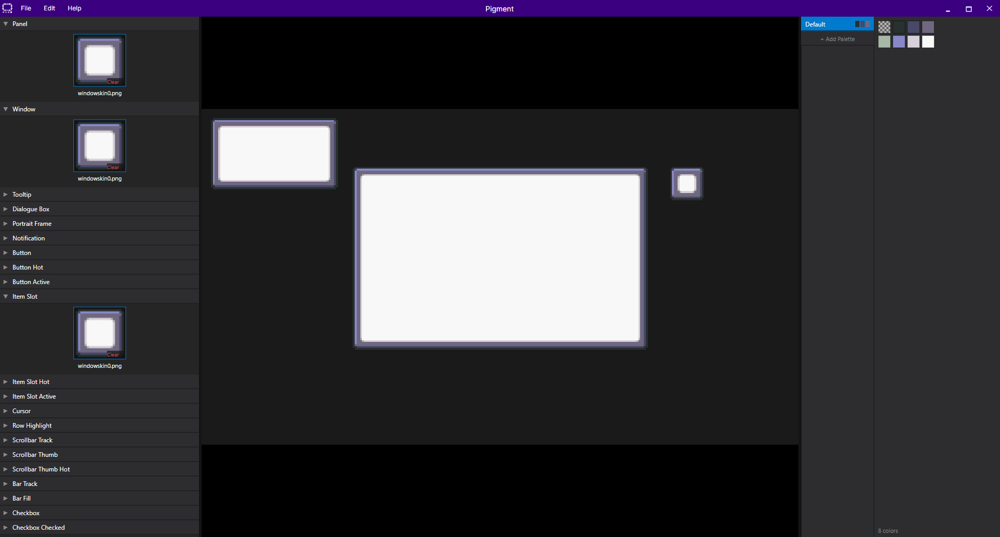
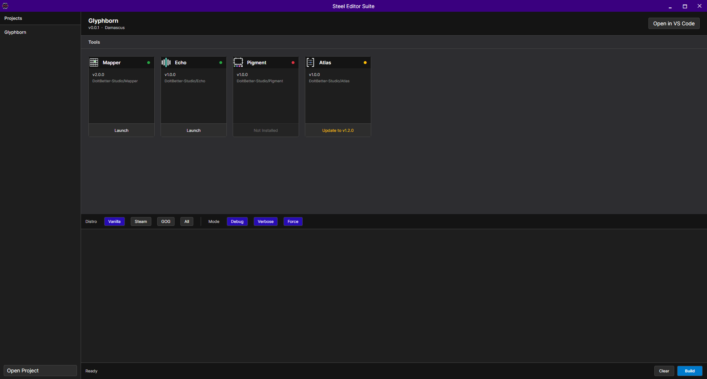

# Welcome to DoItBetter Studio

Welcome to **DoItBetter Studio**, an independent game development studio founded by Anthony T. Lawrence.

> **"Strive for more than just Perfection."**

Our mission is to build immersive worlds powered by custom technology, thoughtfully crafted tools, and systems designed to stand the test of time. Every part of our workflow—from the engine to the editors—is built in-house with creators, modders, and long-term projects in mind.

---

## ⚔️ Featured Project — Glyphborn

Glyphborn is a handcrafted historical Viking sandbox built around exploration, survival, roleplay, and player-driven storytelling.

Rather than relying on procedural generation, every landscape, settlement, dungeon, and coastline is carefully designed to create a believable world inspired by Viking-age Europe. Players forge their own path through a classless progression system where reputation, skill, and relationships define who they become.

Built on the **Damascus Engine**, Glyphborn emphasizes deterministic gameplay, true 3D tile-based worlds, deep modding support, and long-term immersion over scripted experiences.

<video src="assets/glyphborn_gameplay.mp4" autoplay loop muted playsinline style="width: 100%; height: auto; object-fit: cover;"></video>

---

## ⚙️ Damascus Engine

Damascus is our custom-built cross-platform game engine developed specifically for large handcrafted worlds.

Designed around deterministic systems and data-oriented architecture, Damascus powers world streaming, rendering, animation, scripting, resource management, and gameplay through lightweight resource references and efficient runtime caches.

Every major subsystem—from world streaming to materials and animations—is built to work together through a consistent, scalable architecture.

---

## 🛠 Steel Editor Suite

The Steel Editor Suite is a collection of purpose-built development tools designed alongside Damascus.

Current tools include:

* **Atlas** — World and overworld editor
* **Echo** — Audio authoring tools
* **Forge** — Model, material, and animation pipeline
* **Mapper** — Map and chunk editor
* **Pigment** — Runtime UI skinning editor
* **Steel Hub** — Unified launcher and project management

Together, these tools form an integrated workflow where assets move seamlessly from creation to the engine with minimal friction.

---

## 📜 XenoScript

XenoScript is our custom scripting language built specifically for Damascus.

Designed for deterministic gameplay and secure modding, XenoScript allows creators to extend games without exposing unsafe engine functionality. Scripts compile into efficient bytecode and execute inside a sandboxed virtual machine designed for long-term compatibility and stability.

---

## ⚙️ Our Philosophy

Technology should empower creativity—not limit it.

Every engine system, editor, asset pipeline, and scripting tool we develop exists for one purpose: enabling richer worlds and better experiences for both developers and players.

We believe handcrafted worlds, deterministic systems, powerful creator tools, and thoughtful design produce games that remain engaging for years—not just weeks.

---

## ⚠️ Disclaimer

**DoItBetter Studio** and associated trademarks are currently unregistered.

LLC formation and trademark registration are planned.

Names, logos, and branding may change as development continues.

Thank you for supporting independent game development.

