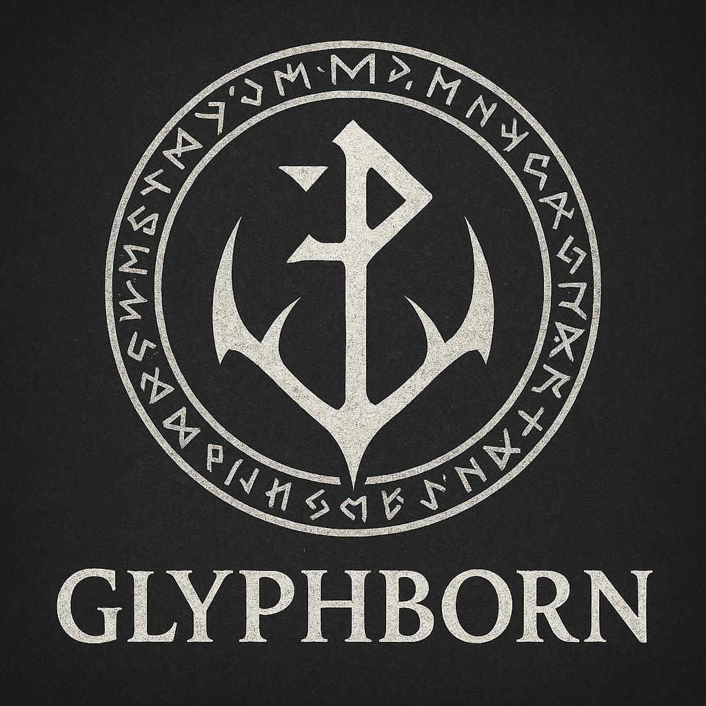

> **"The world should exist independently of the player."**

**Glyphborn** is a handcrafted open-world role-playing game set during the Viking Age, built from the ground up on the **Damascus Engine**. Rejecting procedural generation, every landscape, settlement, road, cave, and coastline is intentionally designed to create a believable, immersive world inspired by the history, cultures, and geography of Northern Europe.

Glyphborn places player freedom above scripted pathways: there are no predefined classes, no forced playstyles, and no single "correct" path through the continent. Instead, players develop naturally through the choices they make, the skills they practice, and the relationships they build.

---

## Core Pillars

### 🌲 A Handcrafted World
Instead of creating content algorithmically, Glyphborn focuses on creating places worth remembering:
* **Dynamic Chunk Streaming:** Explore vast continental landscapes seamlessly without traditional loading screens, powered by Damascus' map chunk streaming pipeline.
* **Layered Tileset System:** Regional tilesets define country-wide biomes, local tilesets introduce unique settlements and castles, and interior tilesets render dungeons and structures with maximum resource efficiency.

### ⚔️ Classless Character Progression
* **Practice-Based Mastery:** You are defined by what you do, not what you select at character creation. Skills naturally improve through usage.
* **Unrestricted Growth:** Combat, survival, crafting, trading, and diplomacy all contribute to your development without forcing you into rigid archetypes.

### 🌍 An Autonomous World
* **Living Regional Systems:** Settlements have distinct identities, regions foster unique cultures, and the world continues whether the player is present or not.
* **Meaningful Exploration:** Travel has weight and consequence, rewarding curiosity and spatial observation over simply following objective UI markers.

---

## Built on Custom Technology

### Damascus Engine & Steel Editor Suite
Glyphborn is powered entirely by custom, in-house technology. Every asset—from world maps and models to materials, user interfaces, animations, and core systems—is constructed using the **Damascus Engine** and the **Steel Editor Suite**. This close integration allows the game, engine, and editors to evolve together with maximum performance and zero bloat.

### Native Modding via XenoScript
Designed for long-term community extensibility, Glyphborn provides deep modding support through **XenoScript**. Creators can build new gameplay mechanics, quests, and custom content within a deterministic, sandboxed execution environment built specifically for Damascus.

---

## Project Hub & Resources

Glyphborn represents the core vision of DoItBetter Studio—building a world players want to return to not because it is endless, but because it feels alive.

* 📖 **[Read the Full Game Design Document (GDD)](https://github.com/DoItBetter-Studio/Glyphborn/blob/main/GDD.md)**
* 🛠️ **<a href="#" data-file="Damascus.md">Explore the Damascus Engine Specs</a>**
* 📜 **[XenoScript Modding Guides]()**